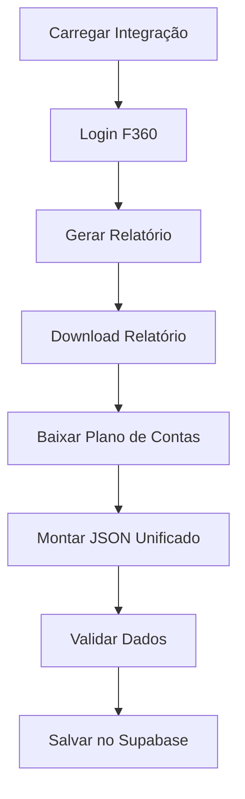

# 📋 Análise do Guia "F360 Geral" - Importação em um único arquivo

**Data:** 2025-01-XX  
**Status:** ✅ Guia bem estruturado, com alguns ajustes necessários para alinhamento

---

## ✅ O QUE ESTÁ CORRETO

### 1. Fluxo de Autenticação F360
- ✅ Endpoint correto: `POST /PublicLoginAPI/DoLogin`
- ✅ Uso de JWT para requisições subsequentes
- ✅ Implementação já existe em `src/services/f360Service.ts`

### 2. Endpoints da API
- ✅ `POST /PublicRelatorioAPI/GerarRelatorio` - correto
- ✅ `GET /PublicRelatorioAPI/Download` - correto
- ✅ `GET /PlanoDeContasPublicAPI/ListarPlanosContas` - correto
- ✅ Todos os endpoints mencionados estão implementados no `F360Service`

### 3. Conceito SINGLE vs GROUP
- ✅ Explicação clara da diferença entre token de empresa única e token de grupo
- ✅ Tratamento de `CNPJEmpresas: []` para trazer todas as empresas
- ✅ Alinhado com a estrutura atual do banco (`is_group`, `group_token`, `parent_company_id`)

### 4. Estrutura do JSON Unificado
- ✅ Formato bem pensado para padronização
- ✅ Campos `source`, `integration`, `period`, `companies`, `chartOfAccounts`, `entries`
- ✅ Preservação de dados originais em `raw.f360`

---

## ⚠️ PONTOS QUE PRECISAM AJUSTE

### 1. Armazenamento de Tokens (CRÍTICO)

**Problema identificado:**

O guia sugere uma estrutura de "integração" separada:
```json
{
  "integrationId": "int_f360_001",
  "mode": "SINGLE",
  "f360PublicToken": "TOKEN_PUBLICO_AQUI",
  "expectedCompanies": [...]
}
```

**Realidade atual do banco:**
- Tokens são armazenados diretamente na tabela `companies.token_f360`
- Grupos usam `companies.is_group = true` e `companies.group_token`
- Empresas filhas usam `companies.parent_company_id`

**Recomendação:**

**Opção A (Alinhar guia com estrutura atual):**
- Modificar o guia para refletir que tokens vão em `companies.token_f360`
- Para grupos: usar `is_group = true` e `group_token`
- `expectedCompanies` pode ser uma lista de CNPJs que devem existir em `companies`

**Opção B (Criar tabela de integrações - melhoria futura):**
- Criar tabela `f360_integrations` conforme sugerido em `docs/SCHEMA_MULTI_TENANT.md`
- Migrar tokens existentes para nova estrutura
- Atualizar código para usar nova estrutura

**Sugestão:** Manter estrutura atual por enquanto, mas documentar no guia que:
- Tokens SINGLE: `companies.token_f360` (uma empresa = um token)
- Tokens GROUP: `companies.group_token` (empresa com `is_group = true`)
- Empresas filhas: `companies.parent_company_id` aponta para empresa grupo

---

### 2. Mapeamento de Dados para Banco

**Problema identificado:**

O guia propõe um JSON unificado, mas o banco tem tabelas normalizadas:
- `dre_entries`
- `dfc_entries`
- `bank_accounts`
- `bank_transactions`
- `chart_of_accounts`
- `accounting_entries`

**Recomendação:**

Adicionar seção no guia explicando:
1. **Fase 1**: Gerar JSON unificado (conforme descrito)
2. **Fase 2**: Mapear JSON para tabelas do Supabase:
   - `entries[]` → `dre_entries` ou `dfc_entries` ou `accounting_entries`
   - `chartOfAccounts[]` → `chart_of_accounts`
   - `companies[]` → verificar/atualizar `companies`
   - Dados bancários → `bank_accounts` e `bank_transactions`

**Exemplo de mapeamento:**
```typescript
// Pseudocódigo
for (const entry of f360Geral.entries) {
  if (entry.type === 'DRE') {
    await insertDRE({
      company_cnpj: entry.cnpj,
      date: entry.date,
      account: entry.debitAccountId,
      valor: entry.amount,
      // ...
    })
  }
  // ...
}
```

---

### 3. Tratamento de CNPJ em Grupos

**Problema identificado:**

O guia menciona que "em clientes de grupo, algumas respostas voltam com campo de CNPJ vazio", mas não detalha a estratégia de mapeamento.

**Recomendação:**

Adicionar seção específica sobre estratégias de mapeamento:

**Estratégia 1: Usar expectedCompanies**
```typescript
// Se CNPJ vazio no relatório, usar expectedCompanies[0].cnpj
if (!entry.cnpj && integration.mode === 'SINGLE') {
  entry.cnpj = integration.expectedCompanies[0].cnpj
}
```

**Estratégia 2: Identificadores internos**
```typescript
// Se relatório trouxer campo de loja/unidade, mapear para CNPJ
if (entry.companyInternalId) {
  const company = integration.expectedCompanies.find(
    c => c.internalId === entry.companyInternalId
  )
  if (company) entry.cnpj = company.cnpj
}
```

**Estratégia 3: Dados consolidados**
```typescript
// Se não conseguir mapear, marcar como consolidado
if (!entry.cnpj && integration.mode === 'GROUP') {
  entry.cnpj = null // ou usar um CNPJ "virtual" do grupo
  entry.isConsolidated = true
}
```

---

### 4. Validação de Dados

**Falta no guia:**

Não há menção a validações antes de salvar no banco.

**Recomendação:**

Adicionar seção sobre validações:
- ✅ CNPJs devem existir em `companies`
- ✅ Datas devem estar no formato correto
- ✅ Valores numéricos devem ser válidos
- ✅ IDs de plano de contas devem existir em `chart_of_accounts`
- ✅ Verificar duplicatas (usar constraints UNIQUE do banco)

---

### 5. Tratamento de Erros

**Falta no guia:**

Não há menção a tratamento de erros durante o processo.

**Recomendação:**

Adicionar seção sobre:
- Retry logic para requisições F360
- Tratamento de timeouts
- Logging de erros (usar `import_logs` existente)
- Rollback em caso de falha parcial

---

## 📝 SUGESTÕES DE MELHORIA

### 1. Adicionar Diagrama de Fluxo



### 2. Adicionar Exemplos de Código

Incluir exemplos práticos de:
- Como buscar integração do banco
- Como mapear JSON para tabelas
- Como lidar com erros

### 3. Adicionar Seção de Troubleshooting

- Problemas comuns e soluções
- Como debugar falhas
- Logs importantes

### 4. Alinhar com Regras do Projeto

Adicionar nota sobre:
- ✅ Tokens NUNCA vão no `.env.local` (regra crítica)
- ✅ Sempre criar registro em `user_companies` ao importar empresa
- ✅ Sempre incluir `company_cnpj` e `company_id` nos dados financeiros

---

## ✅ CONCLUSÃO

O guia está **bem estruturado e correto** na maior parte, mas precisa de ajustes para:

1. **Alinhar com estrutura atual do banco** (tokens em `companies.token_f360`)
2. **Adicionar mapeamento para tabelas normalizadas** (não apenas JSON unificado)
3. **Detalhar estratégias de mapeamento de CNPJ** em grupos
4. **Incluir validações e tratamento de erros**

**Prioridade de ajustes:**
- 🔴 **ALTA**: Ajustar seção de armazenamento de tokens (alinhar com banco atual)
- 🟡 **MÉDIA**: Adicionar mapeamento para tabelas do Supabase
- 🟢 **BAIXA**: Adicionar exemplos de código e troubleshooting

---

## 📚 REFERÊNCIAS

- Estrutura atual: `supabase/migrations/create_f360_volpe_tables.sql`
- Serviço F360: `src/services/f360Service.ts`
- Regras do projeto: `.cursorrules`
- Schema multi-tenant: `docs/SCHEMA_MULTI_TENANT.md`

